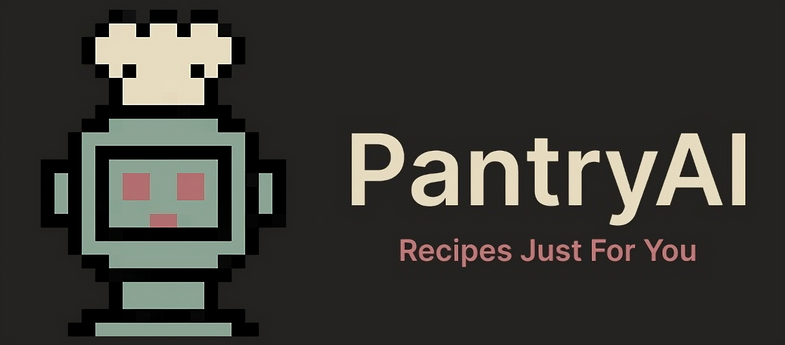

# 

# 🍽️ About the App
Every find yourself stuck figuring out what to cook with the ingredients you have at home? PantryAI aims to help solve this problem.
This web application allows users to transfer their at home pantry to a digital space where Artificial Intelligence will seemlessly generate recipes based on the meal type selected. Built with Flask, Javascript, and Google Gemini API, the app enforces strong security practices and a clean user interface.

This app was created by Logan Pinel and completed on August 24th, 2025